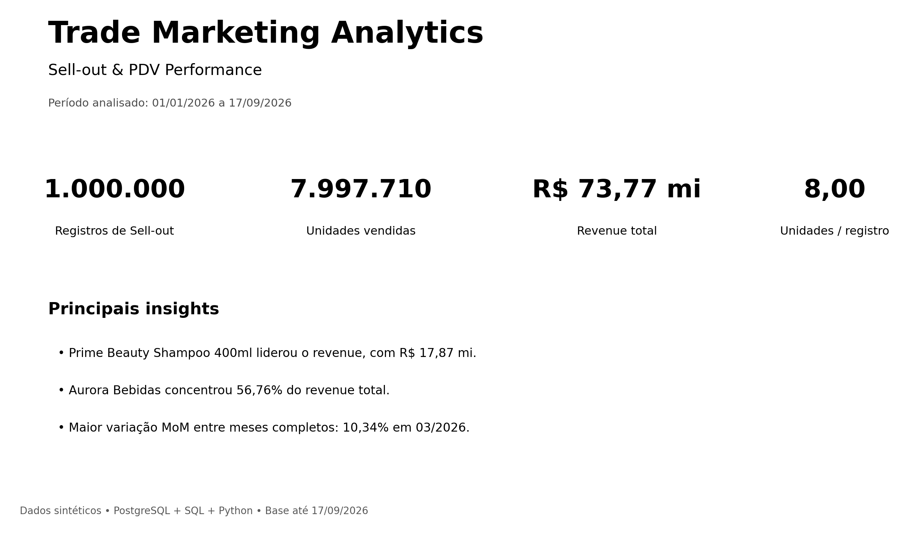
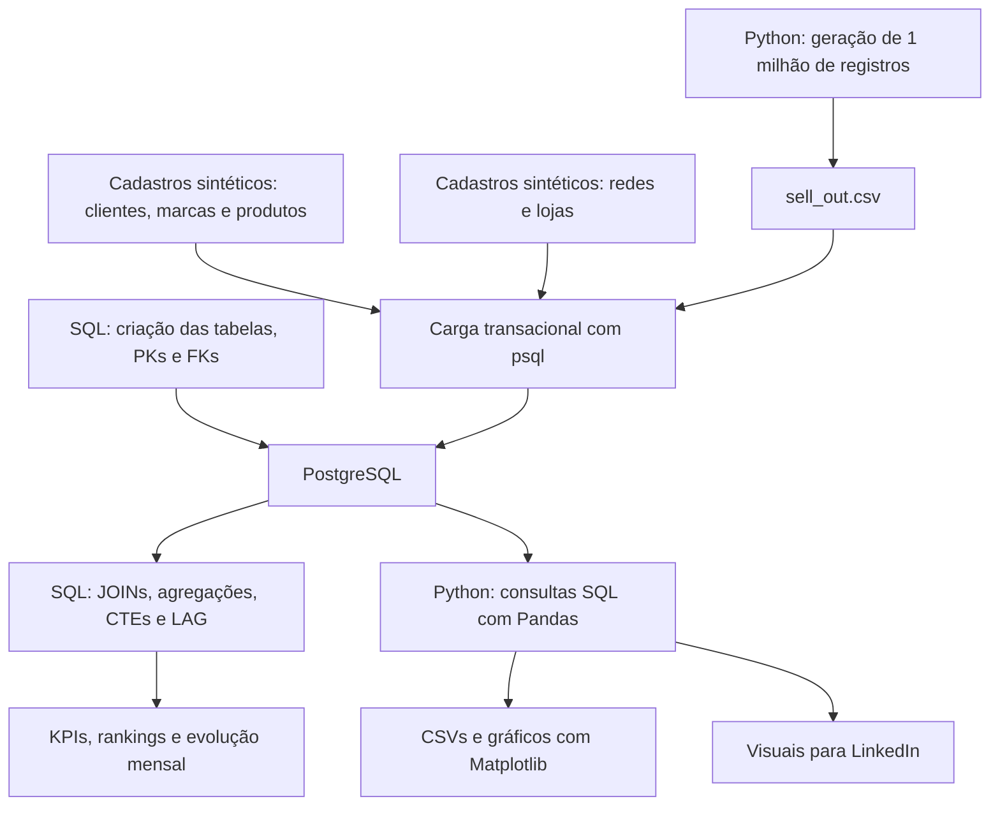
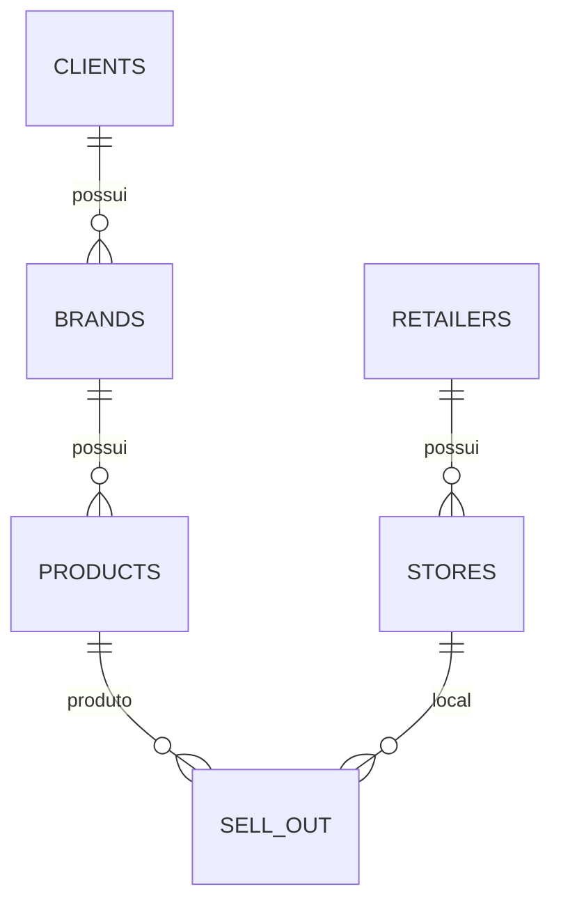
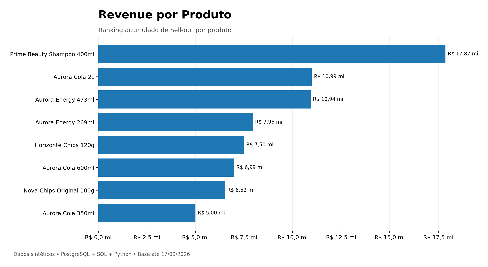
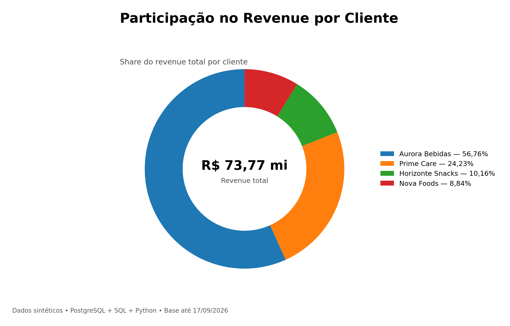
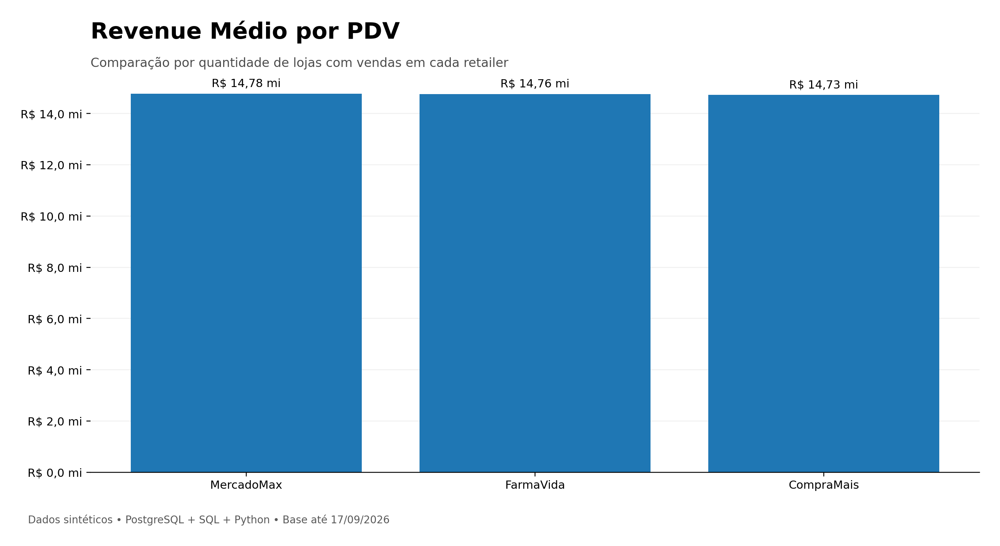
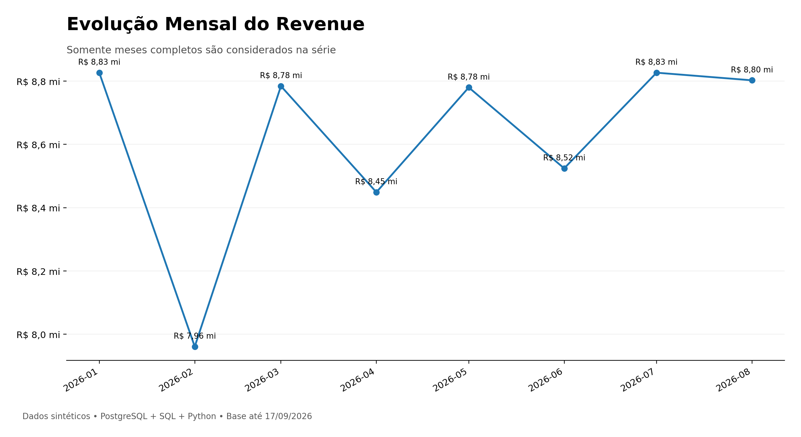
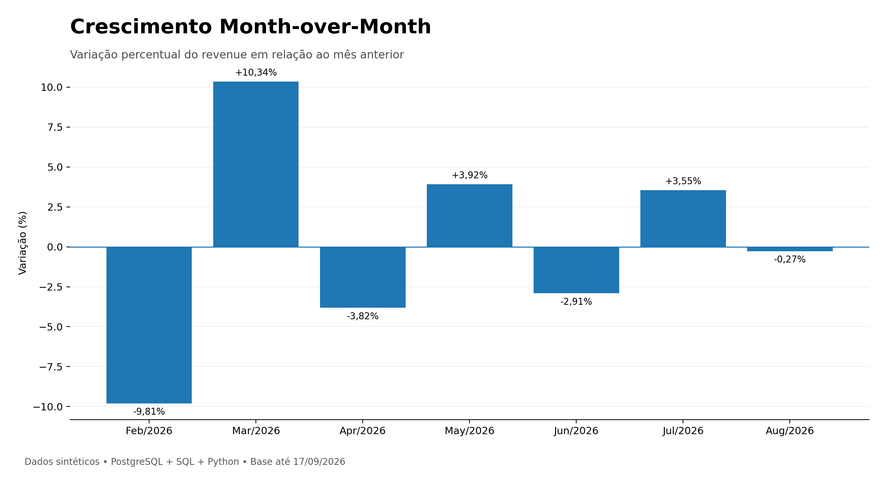

# Trade Marketing Analytics — Sell-out & PDV Performance

Análise de **1 milhão de registros sintéticos** com **PostgreSQL, SQL e Python**, explorando produtos, clientes, redes varejistas e pontos de venda (PDVs).

O objetivo é transformar registros de sell-out em indicadores comerciais, comparar desempenho em diferentes níveis e automatizar a entrega das análises.



## Resultados do case original

| Indicador | Resultado |
|---|---:|
| Registros de sell-out | 1.000.000 |
| Unidades vendidas | 7.997.710 |
| Receita total | R$ 73.766.342,17 |
| Unidades por registro | 8,00 |
| Receita média por registro | R$ 73,77 |
| Maior variação MoM entre meses completos | +10,34% — março/2026 |

Período: **01/01/2026 a 17/09/2026**. A comparação mensal considera janeiro a agosto.
Receita = quantidade × preço unitário. Receita média por registro **não é ticket médio**: não há identificador de pedido ou cupom.

## Como funciona



O fluxograma também está disponível em [diagrams/pipeline.mmd](diagrams/pipeline.mmd).
Os scripts Python de outputs executam suas consultas SQL diretamente no banco; a pasta `sql/` permite explorar as análises manualmente.

## Modelo relacional



| Tabela | Chave primária | Relacionamentos |
|---|---|---|
| clients | client_id | Clientes detentores das marcas |
| brands | brand_id | client_id → clients |
| products | product_id | brand_id → brands |
| retailers | retailer_id | Redes varejistas |
| stores | store_id | retailer_id → retailers |
| sell_out | sell_out_id | product_id → products; store_id → stores |

Cada linha de sell-out representa produto, PDV, data, quantidade e preço; pode haver várias linhas para a mesma combinação. Os cadastros incluem clientes sem vendas.

## Principais análises

- **Produtos:** Prime Beauty Shampoo 400ml lidera a receita (~R$ 17,87 milhões), sem liderar o volume. Preço e mix influenciam essa diferença.
- **Clientes:** Aurora Bebidas concentra 56,76% da receita; Prime Care, 24,23%; Horizonte Snacks, 10,16%; Nova Foods, 8,84%. Percentuais arredondados podem não somar exatamente 100%.
- **Redes:** MercadoMax e CompraMais têm dois PDVs cada; FarmaVida tem um. A receita média por PDV com vendas é semelhante (~R$ 14,7 milhões), apesar das diferenças nos totais.
- **Tempo:** março apresenta +10,34% sobre fevereiro. Isso não comprova melhoria de produtividade: os meses têm quantidades diferentes de dias, e o gerador distribui vendas aleatoriamente.

### Regras e limitações

Dados 100% sintéticos para estudo e portfólio. Não representam resultados de empresas reais nem causalidade comercial.

A média por PDV considera **lojas com vendas no período**. Os JOINs excluem entidades sem vendas dessas análises. Produtos, redes, lojas e clientes são agrupados também por IDs para evitar juntar entidades homônimas.

Meses das extremidades são excluídos quando as datas observadas não cobrem do primeiro ao último dia. Essa regra é uma aproximação para este cenário sintético, não uma auditoria da ingestão. Meses intermediários sem registros permanecem nulos; o MoM não compara meses separados por lacunas. Denominador zero gera MoM nulo.

## Estrutura

| Pasta/arquivo | Conteúdo |
|---|---|
| `data/raw/` | Cinco cadastros CSV e sell-out gerado localmente |
| `database/01_create_tables.sql` | Criação das seis tabelas com PKs, FKs e validações |
| `database/04_load_data.sql` | Carga dos seis CSVs com caminhos relativos |
| `sql/` | Análises executivas, produtos, redes/PDVs, clientes/marcas e MoM |
| `python/generate_sell_out.py` | Gerador com seed e proteção contra sobrescrita |
| `python/generate_analysis_outputs.py` | Seis CSVs analíticos e oito gráficos |
| `python/generate_linkedin_outputs.py` | Seis visuais de apresentação |
| `outputs/` | Resultados e gráficos do case original |
| `diagrams/` | Fluxograma editável em Mermaid |
| `requirements.txt` | Dependências Python |

## Como executar

Pré-requisitos: **PostgreSQL 17**, `psql` no PATH e **Python 3.10+**. VS Code é opcional. Execute os comandos na raiz do projeto.

```powershell
git clone https://github.com/Dummaia/trade-marketing-sql-analytics.git
cd trade-marketing-sql-analytics
python -m venv .venv
.venv\Scripts\Activate.ps1
python -m pip install -r requirements.txt
createdb -h localhost -U postgres trade_marketing
psql -X -h localhost -U postgres -d trade_marketing -v ON_ERROR_STOP=1 -f database/01_create_tables.sql
python python/generate_sell_out.py --seed 42
psql -X -h localhost -U postgres -d trade_marketing -v ON_ERROR_STOP=1 -f database/04_load_data.sql
psql -X -h localhost -U postgres -d trade_marketing -v ON_ERROR_STOP=1 -f sql/01_executive_analysis.sql
python python/generate_analysis_outputs.py
python python/generate_linkedin_outputs.py
```

No Linux/macOS, ative o ambiente com `source .venv/bin/activate`.
Os scripts solicitam a senha sem exibi-la. Host, porta, banco e usuário podem ser configurados por `PGHOST`, `PGPORT`, `PGDATABASE` e `PGUSER`; `PGPASSWORD` é opcional. Não versione credenciais.

O script de carga usa `\copy` do **psql**, não deve ser executado como SQL comum no editor. Os cadastros são carregados antes das vendas, na ordem das FKs. Criação e carga usam transações e exigem banco/tabelas vazios; não apagam dados existentes. Para repetir o case, use um novo banco vazio.

### Reprodutibilidade

Os CSVs e gráficos em `outputs/` preservam a execução original enviada para este case. A base original foi gerada sem seed registrada. **A nova seed 42 reproduz uma nova base, mas não os valores exatos dos outputs originais.** Ao executar os scripts de outputs, os arquivos serão substituídos pelos resultados da sua base. Atualize os números deste README se publicar essa nova execução.

O arquivo `data/raw/sell_out.csv` não é versionado. O gerador cria 1.000.000 de linhas por padrão e aceita `--rows`. Se o arquivo existir, ele interrompe a execução; use `--overwrite` somente para regenerá-lo conscientemente. A quantidade de registros não equivale ao número de transações comerciais.

## Visuais







## Competências aplicadas

Modelagem relacional, integridade referencial, JOINs, agregações, CTEs, funções de janela (`LAG`), análise temporal, indicadores relativos e automação de consultas/visualizações com Pandas, SQLAlchemy, psycopg e Matplotlib.

**Autor: Eduardo Maia** · [GitHub](https://github.com/Dummaia)

## Validação desta revisão

Conferidos os 1.000.000 de registros originais, integridade dos relacionamentos, receitas por produto/rede/loja/cliente e série mensal contra os CSVs publicados. Sintaxe Python e SQL PostgreSQL validada por parser. Os scripts de gráficos foram executados usando os resultados conferidos como entradas de teste. A criação/carga e as consultas ainda precisam de uma execução integrada no PostgreSQL 17; não havia servidor disponível no ambiente de revisão.
